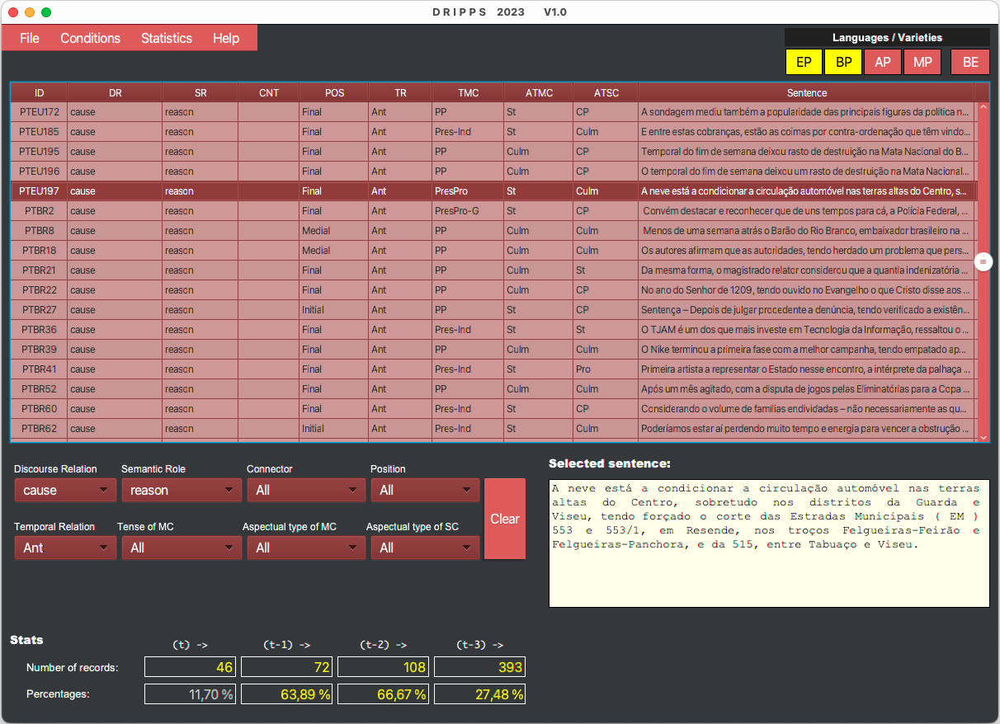
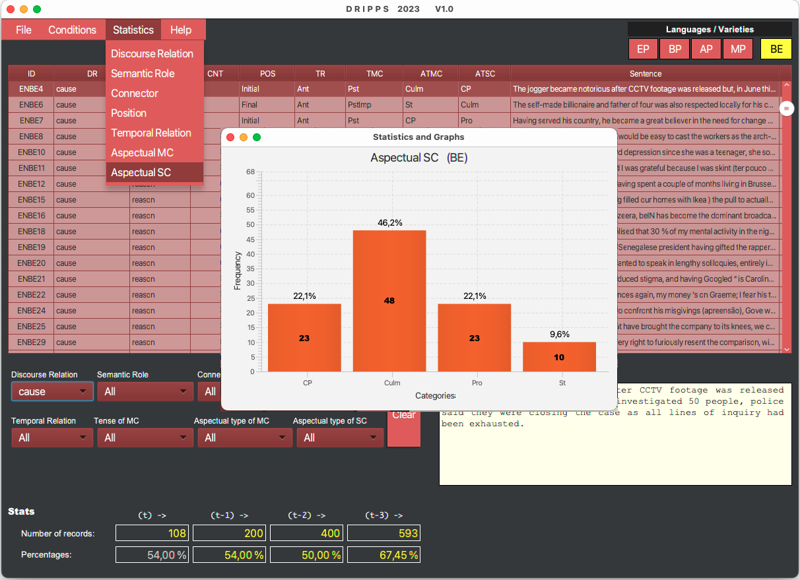
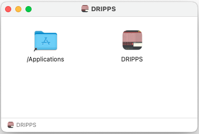
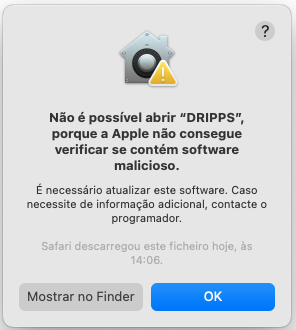
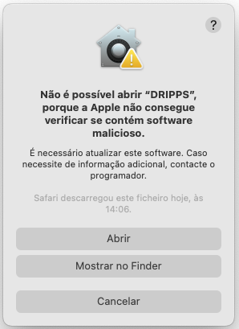

# DRIPPS
## Interface Browser to Study and Explore Discourse Relations

A new language resource, DRIPPS, an annotated corpus of discourse relations in sentences with perfect participial clauses in some varieties of Portuguese (European (EP), Brazilian (BP), Angolan (AP) and Mozambican (MP)) and British English (BE). The application allows one to load corpora, Portuguese varieties, and British English, in our case, and apply a set of selection constraints to obtain different views and statistics of the data, enabling a whole range of specific corpora analyses and studies. [Figure 1](#figure-mainview) presents the application's main view, where the dataset of annotated sentences from different varieties/languages might be loaded into the main table, the main component of this view. 

<!---:label:figure-mainview --->
*Figure 1: The DRIPPS application to load and explore DRel corpora.*

The table presents one sentence per line with its corresponding annotations: Discourse Relation (DR), Semantic Role (SR), etc. The last column contains the sentences, which are not entirely visible. However, each table's selected sentence is totally visible below in a specific box for that purpose (light yellow colour). The set of buttons above the table, on the right-hand side, allows one to select the varieties/languages’ examples to be shown. Each one of these buttons can be independently activated and deactivated, meaning that different sets of varieties/languages can be combined and loaded into the table. In the screenshot, we can see that only the European (EP) and Brazilian Portuguese (BP) varieties are selected.

<!---:label:figure-statistics --->
*Figure 2: Selecting a statistical graph of the "Aspectual SC" distribution for the BE corpus with Discourse Relation selected on "cause".*

In [Figure 2](#figure-statistics) we have an exemplification on the generation of statistical distributions for a given data configuration loaded to the applications' table. The data configuration depends on the selected/loaded corpora and the selected constraints applied on the panel. In this particular case, we can see a graph distribution for the Aspectual type of the SC, for the British English corpus, given that the Discourse Relation is set to cause. The application allows generating several graphs like this simultaneously and for different data configurations, which enables one, for example, to compare similar phenomena on different corpora.

## Citing our Work

More information about our work on discourse relations can be obtained in the following publication:

*Silvano, P., Cordeiro, J., Leal, A., and Pais, S. DRIPPS: a Corpus with Discourse Relations in Perfect Participial Sentences.*
*To be published by ACL in an open-access conference proceedings volume. September 2023.*

If you find this work interesting/useful, please cite it in your own work. Thank you in advance!

## Download and Installation

The DRIPPS interface is a project developed in Java language, thus being *platform agnostic*. However, some platform nuances must be regarded as it uses the JavaFX library. Especially on the macOS machines, some security concerns must be overcome by explicitly trusting the application being installed.

Specific installation files are provided below. Note that you must have at least *Java 17* installed on your machine.

### Windows Platform

You may download and install the following [DRIPPS-1.0.msi](https://www.di.ubi.pt/~jpaulo/a/DRIPPS-1.0.msi.zip) file for the Windows platform. The installation shall be straightforward, and at the end, you will get a new folder named DRIPPS inside your "Program Files" or "Programs" folder. The DRIPPS.exe executable is inside this folder.

### MacOs X Platform

For the MacOs platform, you may download and install the following [DRIPPS-1.0.dmg](https://www.di.ubi.pt/~jpaulo/a/DRIPPS-1.0.dmg.zip) file (Intel processor) or [DRIPPS-1.1-M2.dmg](https://www.di.ubi.pt/~jpaulo/a/DRIPPS-1.1-M2.dmg.zip) file (M2 processor). After opening the installer (dmg file), you shall see your *Applications* folder and the *DRIPPS.app* application, as shown in the figure below:

Move the app to your *Applications* folder and close the window. Then, open your *Applications* folder and locate the application icon. Now if you try to open the application with just a double click you will get a security inibition message, similar to what is shown in the following image:

To overcome this security warning, use "control+mouse click" and pick the "Open" ("Abrir") option. Then a similar message, as shown in the following figure, will be displayed, still giving the security warning but also allowing for the opening of the application through the "Open" ("Abrir") button:

This is only necessary for the first run. Subsequent runnings are allowed just by using a double click on the app's icon.

