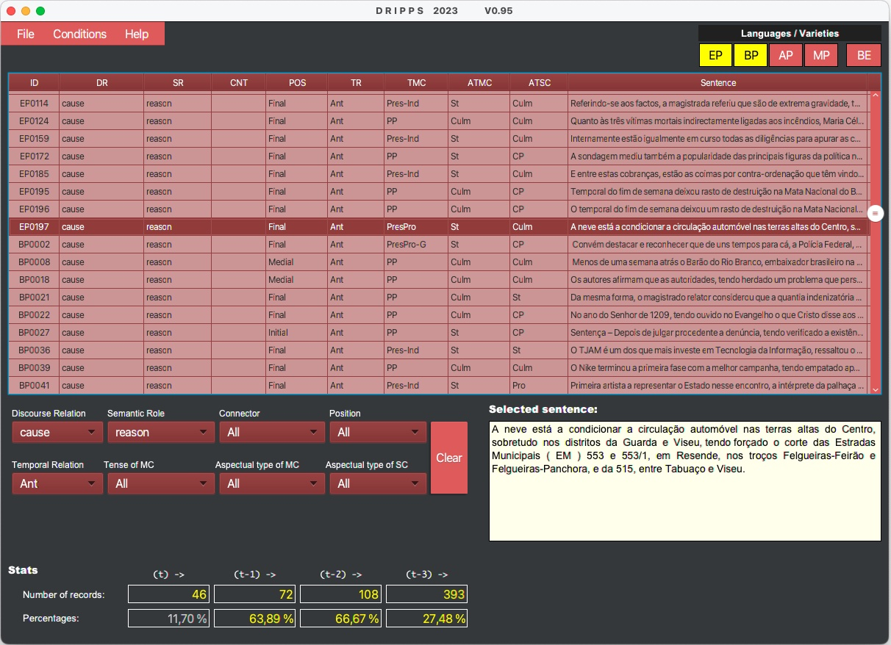

# DRIPPS
## Interface Browser to Study and Explore Discourse Relations

A new language resource, DRIPPS, an annotated corpus of discourse relations in sentences with perfect participial clauses in some varieties of Portuguese (European (EP), Brazilian (BP), Angolan (AP) and Mozambican (MP)) and British English (BE).

To be completed/continued ...
